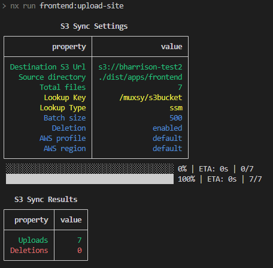

# nx-s3-plugin

[](https://www.npmjs.com/package/nx-s3-plugin)

This is an NX executor that can be used to make changes to remote S3 buckets.

## Installation

Install the plugin in to your already configured NX workspace

```sh
npm i nx-s3-plugin
```

## Executors

| Name | Description                                           |
| ---- | ----------------------------------------------------- |
| sync | Synchronize a local directory with a remote S3 bucket |

## `sync`



The `sync` executor is similar to the `aws s3 sync` command. It will run a diff between local files and files contained in S3, and make S3 reflect the local directory. This can be very performant because only files which have changed will be uploaded. Bucket name can also be dynamically looked up from existing CloudFormation exports.

### Properties

| Name        | Description                                                                                                                        |
| ----------- | ---------------------------------------------------------------------------------------------------------------------------------- |
| sourceFiles | The path to the local files that you wish to upload. In the case of a static site, these should already be compiled (ie webpack).  |
| bucketName  | The name of the S3 bucket where the files should be uploaded. _See notes on setting this value to retrieve a CF exported value._   |
| region      | (Optional) The AWS region where requests will be sent. Will default to the local system default.                                   |
| profile     | (Optional) The AWS credentials profile that will be used to make requests. Default system AWS credentials will be used if omitted. |
| batchSize   | (Optional) The number of files that will be present in each batch. Batched files are uploaded in parallel. Default is 500.         |
| progress    | (Optional) Display upload progress. True by default.                                                                               |
| deleteFiles | (Optional) Should files be deleted in S3 if they are no longer present in the local directory. True by default.                    |

### Usage

Add the executor to the `target` section of `project.json`.

```js
  "targets": {
    "upload-site": {
      "executor": "nx-s3-plugin:sync",
      "options": {
        "sourceFiles": "<source-directory>",
        "bucketName": "[cfe:]<target-bucket>",
      }
    }
  }
```

### Cloudformation Export Lookup

If you prepend your `bucketName` with `cfe:`, this executor will attempt to locate a CloudFormation export with the same name. _Matching is not case-sensitive._ Omitting the `cfe:` prefix will simply use the `bucketName` value as is for the S3 url.

- If an export is found with a matching name, the value will be used for the S3 destination bucket.
- If an export is not found, an error will be thrown and no files will be uploaded.

**This export must exist in the same account as the S3 bucket. Cross-account lookup is not supported.**
